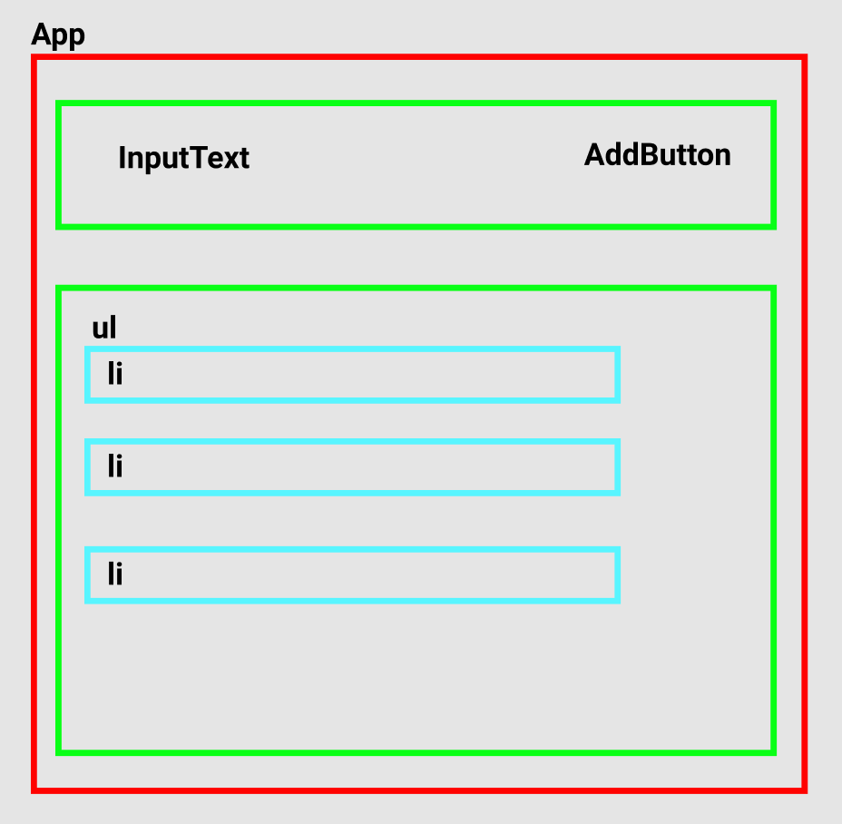

# Review React

## English

- Create application from scratch with create-react-app
- Create initial App component
- Separate App component into several components
- Put state and props into each components
- Put function to update state in component (setState)
- Pass data/function into child component from parent component (from top to bottom)
- Pass data/function from child component into parent component (from bottom to top)
- Styling with styled-components

## Indonesian

- Bikin aplikasi dari awal lagi
- Bikin App component
- Pisah App component tersebut menjadi beberapa component
- Pasang state dan props di tiap component tersebut
- Pasang function untuk update state di component (setState)
- Lempar data ke component child dari parent (atas ke bawah)
- Lempar data dari component child ke parent (bawah ke atas)
- Styling dengan styled-components

## Architecture

